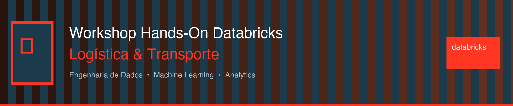
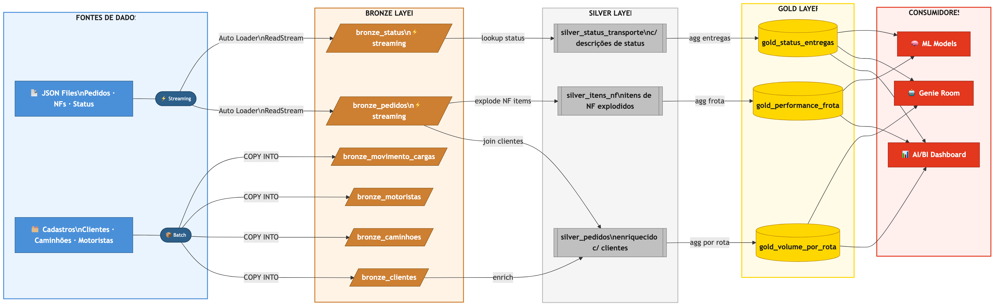
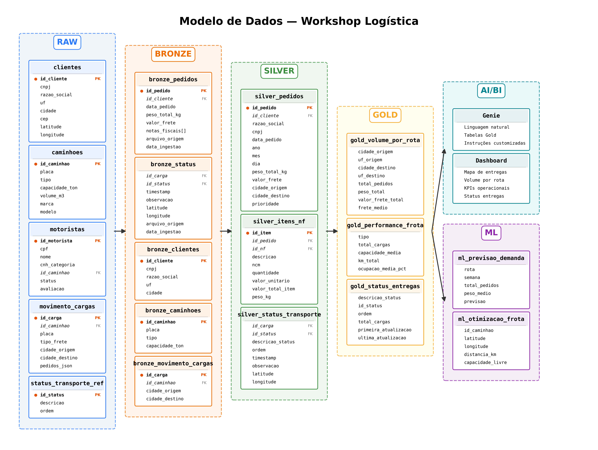
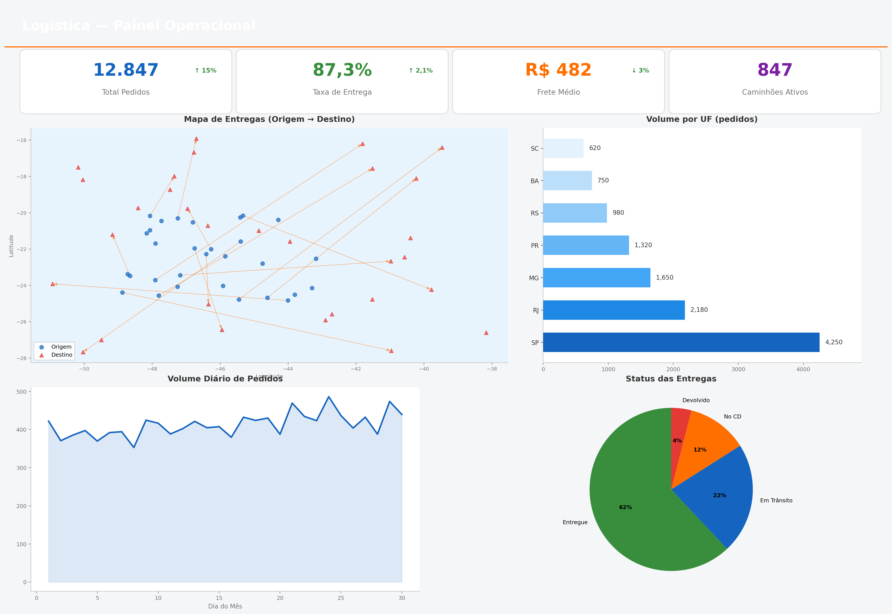

<p align="center">
  
</p>

<h1 align="center">🚚 Workshop Hands-On Databricks — Logística</h1>

<p align="center">
  
  
  
  
  
</p>

<p align="center">
  Workshop prático de <strong>Engenharia de Dados, Machine Learning e Analytics</strong> aplicados ao setor de <strong>Logística e Transporte</strong>, utilizando a plataforma Databricks.
</p>

---

## 👥 Apresentadores

<table align="center">
  <tr>
    <td align="center" width="300">
      <br>
      <strong>Juliandro Figueiró</strong><br>
      <em>Sr. Solution Architect</em><br>
      <a href="https://www.linkedin.com/in/juliandro/">LinkedIn</a>
    </td>
    <td align="center" width="300">
      <br>
      <strong>Jean Ertzogue</strong><br>
      <em>Account Executive</em><br>
      <a href="https://www.linkedin.com/in/jeanertzogue/">LinkedIn</a>
    </td>
    <td align="center" width="300">
      <br>
      <strong>Marcio Arbex</strong><br>
      <em>Field Engineering Director</em><br>
      <a href="https://www.linkedin.com/in/marcioarbex/">LinkedIn</a>
    </td>
  </tr>
</table>

---

## 📋 Agenda

| #  | Atividade | Duração | Descrição |
|----|-----------|---------|-----------|
| ⚙️ | **Setup Inicial** | 15 min | Configuração do catálogo e geração dos dados sintéticos |
| 1️⃣ | **Lab 1 — Spark Declarative Pipelines** | 40 min | Construção do pipeline medallion (Bronze → Silver → Gold) com streaming |
| ☕ | **Coffee Break** | 15 min | — |
| 2️⃣ | **Lab 2 — Lakeflow Jobs** | 25 min | Orquestração de tarefas com DAGs, monitoramento e alertas |
| 3️⃣ | **Lab 3 — Machine Learning** | 35 min | Predição de demanda, otimização de frota e pedidos surpresa |
| 4️⃣ | **Lab 4 — AI/BI Genie + Dashboard** | 30 min | Dashboard operacional com mapas e assistente inteligente Genie |
| 🎯 | **Encerramento** | 10 min | Resumo, próximos passos e Q&A |
| | **Total** | **~170 min** | |

---

## 🏗️ Arquitetura

<p align="center">
  
</p>

O workshop segue a arquitetura **Medallion (Bronze → Silver → Gold)**, processando dados de operações logísticas desde a ingestão via streaming até a camada analítica:

- **Fontes**: JSONs de pedidos, notas fiscais e status de transporte (streaming) + cadastros estáticos
- **Bronze**: Dados brutos com metadados de ingestão
- **Silver**: Dados limpos, enriquecidos e normalizados
- **Gold**: Agregações e KPIs prontos para consumo

---

## 📊 Modelo de Dados

<p align="center">
  
</p>

### Tabelas Principais

| Tabela | Registros | Descrição |
|--------|-----------|-----------|
| `clientes` | 1.000 | Empresas do Sudeste com CNPJ, coordenadas geográficas |
| `caminhoes` | 1.000 | Frota com tipos VUC a Rodotrem, capacidades e dimensões |
| `motoristas` | 1.000 | Motoristas vinculados a caminhões, com CNH e avaliação |
| `pedidos` | 10.000+ | Pedidos com totais calculados a partir dos itens das NFs (peso, volume, valor, frete) e array de NF IDs |
| `notas_fiscais` | 60.000 | NFs vinculadas a pedidos com chave de acesso |
| `itens_nf` | ~240.000 | Itens detalhados por NF (produtos, pesos, dimensões) |
| `movimento_cargas` | 5.000 | Cargas em transporte com rotas e pedidos (JSON) |
| `historico_status` | 10.000+ | Tracking de status com geolocalização |
| `status_transporte_ref` | 15 | Tabela de referência de status |
| `produtos_referencia` | 200 | Produtos transportados com NCM e categorias |

---

## ✅ Pré-requisitos

### Workspace Databricks
- Workspace com **Unity Catalog** habilitado
- **Serverless** habilitado (recomendado para SDP)
- Acesso a **SQL Warehouse** (Serverless ou Pro)

### Permissões Necessárias

| Recurso | Permissão | Labs |
|---------|-----------|------|
| `CREATE CATALOG` | Metastore Admin ou permissão delegada | Setup |
| `CREATE SCHEMA` | Catalog Owner | Setup |
| `CREATE TABLE` | Schema Owner | Todos |
| `CREATE VOLUME` | Schema Owner | Setup |
| Cluster / Compute | `CAN ATTACH TO` | Todos |
| SQL Warehouse | `CAN USE` | Lab 4 |
| Spark Declarative Pipelines (SDP) | `CAN MANAGE` | Lab 1 |
| Workflows / Jobs | `CAN MANAGE` | Lab 2 |
| MLflow Experiments | `CAN MANAGE` | Lab 3 |
| AI/BI Dashboards | `CAN CREATE` | Lab 4 |
| AI/BI Genie | `CAN CREATE` | Lab 4 |

---

## 📁 Estrutura do Projeto

```
databricks_lab_logistica/
│
├── 00_Setup/
│   ├── 00_configuracao_catalogo.py    # Cria catálogo, schemas e volumes
│   └── 01_dados_cadastrais.py         # Gera todos os dados sintéticos
│
├── 01_Lab_SDP/
│   ├── 01a_gerador_streaming.py       # Gerador contínuo de JSONs (pedidos, NFs, status)
│   ├── 01b_sdp_pipeline_to_do.py      # Pipeline SDP com TO-DOs (exercício)
│   └── 01c_sdp_pipeline_completo.py   # Pipeline SDP completo (referência)
│
├── 02_Lab_Jobs/
│   ├── 02a_validacao_to_do.py         # Task 1: Validação de dados (exercício)
│   ├── 02b_trigger_pipeline_to_do.py  # Task 2: Trigger via API (exercício)
│   ├── 02c_qualidade_to_do.py         # Task 3: Quality checks (exercício)
│   ├── 02d_resumo_to_do.py            # Task 4: Resumo da execução (exercício)
│   ├── 02e_validacao_completo.py      # Task 1: Referência completa
│   ├── 02f_trigger_pipeline_completo.py # Task 2: Referência completa
│   ├── 02g_qualidade_completo.py      # Task 3: Referência completa
│   └── 02h_resumo_completo.py         # Task 4: Referência completa
│
├── 03_Lab_ML/
│   ├── 03a_ml_to_do.py                # ML com TO-DOs (exercício)
│   └── 03b_ml_completo.py             # ML completo (referência)
│
├── 04_Lab_AIBI/
│   ├── 04a_genie_dashboard_to_do.py   # AI/BI com TO-DOs (exercício)
│   └── 04b_genie_dashboard_completo.py # AI/BI completo (referência)
│
├── images/                             # Diagramas e imagens
└── README.md                           # Este arquivo
```

---

## 🚀 Como Começar

### Passo 1: Importar o Repositório

1. No Databricks, vá em **Workspace** → **Repos**
2. Clique em **Add** → **Git folder**
3. Cole a URL abaixo e clique em **Create Repo**

```
https://github.com/juliandrof/databricks_lab_logistica.git
```

### Passo 2: Configurar o Catálogo

1. Abra `00_Setup/00_configuracao_catalogo.py`
2. Preencha seu nome no widget **`nome_participante`** (sem espaços ou acentos)
3. Execute todas as células

> ⚠️ **IMPORTANTE**: Use o mesmo nome em TODOS os notebooks! O catálogo será `workshop_logistica_{seu_nome}`.

### Passo 3: Gerar os Dados

1. Abra `00_Setup/01_dados_cadastrais.py`
2. Preencha o mesmo nome no widget
3. Execute todas as células (~2-3 minutos)
4. Verifique o resumo final com contagens de todas as tabelas

---

## 🔬 Labs — Detalhes

### Lab 1: Spark Declarative Pipelines (SDP) — 40 min

**Conceito**: Construir um pipeline de dados completo usando a abordagem declarativa do Databricks, com ingestão streaming via Auto Loader e transformações em camadas.

**O que você vai fazer:**
1. **Iniciar o gerador de streaming** (`01a_gerador_streaming.py`) — gera JSONs de pedidos, NFs e status a cada 5 minutos
2. **Completar os TO-DOs** (`01b_sdp_pipeline_to_do.py`) — 6 exercícios
3. **Configurar e executar o pipeline** via UI do Spark Declarative Pipelines

| TO-DO | Descrição | Dificuldade |
|-------|-----------|-------------|
| 1 | Criar tabela `bronze_movimento_cargas` | ⭐ |
| 2 | Extrair ano, mês e dia do pedido | ⭐ |
| 3 | Explodir array de itens da NF | ⭐⭐ |
| 4 | Adicionar expectativa de qualidade | ⭐ |
| 5 | Criar agregação por rota | ⭐⭐ |
| 6 | Criar resumo de status de entregas | ⭐⭐⭐ |

> 💡 **Dica**: Em caso de dúvida, consulte o arquivo `01c_sdp_pipeline_completo.py` como referência.

**Para configurar o pipeline SDP:**
1. Vá em **Jobs & Pipelines** → **ETL pipeline**
2. **Pipeline name**: `pipeline_logistica_{seu_nome}`
3. **Add existing assets**: selecione o notebook `01_Lab_SDP/01b_sdp_pipeline_to_do.py`
4. **Target catalog**: `workshop_logistica_{seu_nome}`
5. **Target schema**: `default` (obrigatório na UI)
6. Em **Configuration**, adicione: Key: `pipeline.nome_participante` → Value: `{seu_nome}`
7. **Compute**: Serverless (recomendado) ou cluster existente
8. Clique em **Create** e depois **Start** para executar

---

### Lab 2: Lakeflow Jobs — 25 min

**Conceito**: Orquestrar múltiplas tarefas como um DAG (Directed Acyclic Graph), automatizar execuções com scheduling e monitorar resultados.

**O que você vai fazer:**
1. **Completar os TO-DOs** em cada notebook de tarefa
2. **Criar um Job** com 4 tarefas encadeadas
3. **Configurar scheduling** e monitoramento

| TO-DO | Descrição | Notebook | Dificuldade |
|-------|-----------|----------|-------------|
| 1 | Validar existência e contagem das tabelas | `02a` | ⭐ |
| 2 | Validar integridade referencial | `02a` | ⭐⭐ |
| 3 | Trigger do pipeline SDP via API | `02b` | ⭐⭐ |
| 4 | Checar valor de frete positivo | `02c` | ⭐ |
| 5 | Validar dados na gold | `02c` | ⭐ |
| 6 | Criar resumo de execução | `02d` | ⭐⭐ |

**Para criar o Job:**
1. Vá em **Workflows** → **Jobs** → **Create Job**
2. Nome: `job_logistica_{seu_nome}`
3. Adicione 4 tarefas na seguinte ordem:

```
Task 1: Validação  ──→  Task 2: Trigger Pipeline  ──→  Task 3: Qualidade  ──→  Task 4: Resumo
```

---

### Lab 3: Machine Learning — 35 min

**Conceito**: Aplicar Machine Learning em três cenários reais de logística: predição de demanda, otimização de caminhões vazios e resposta a pedidos surpresa.

**O que você vai fazer:**
1. **Predição de Demanda** — Prever volume semanal de pedidos por rota
2. **Caminhões Vazios** — Identificar caminhões ociosos e match com pedidos próximos
3. **Pedidos Surpresa** — Encontrar o caminhão mais próximo com capacidade disponível

| TO-DO | Descrição | Use Case | Dificuldade |
|-------|-----------|----------|-------------|
| 1 | Criar features de demanda | Predição | ⭐⭐ |
| 2 | Treinar modelo com MLflow | Predição | ⭐⭐ |
| 3 | Implementar distância Haversine | Caminhões Vazios | ⭐⭐ |
| 4 | Encontrar caminhão para pedido surpresa | Pedido Surpresa | ⭐⭐⭐ |
| 5 | Registrar modelo no Unity Catalog | MLflow | ⭐ |

---

### Lab 4: AI/BI Genie + Dashboard — 30 min

**Conceito**: Criar um dashboard operacional interativo com mapas e utilizar o Genie para permitir que qualquer pessoa faça perguntas aos dados em linguagem natural.

**O que você vai fazer:**
1. **Criar views otimizadas** para dashboarding
2. **Configurar um Genie Room** com contexto das tabelas
3. **Criar um Dashboard Lakeview** com KPIs, gráficos e **mapa de entregas**
4. **Testar o Genie** com perguntas em português

| TO-DO | Descrição | Dificuldade |
|-------|-----------|-------------|
| 1 | Criar view geográfica para mapa de entregas | ⭐⭐ |
| 2 | Criar view de volume diário | ⭐ |
| 3 | Adicionar comentários para Genie | ⭐ |
| 4 | Query de status para KPI cards | ⭐ |

**Sugestão de layout do Dashboard:**

<p align="center">
  
</p>

---

## ⚡ Dicas Importantes

> 🔄 **Consistência**: Use sempre o **mesmo nome** no widget `nome_participante` em todos os notebooks.

> 📖 **Referência**: Cada lab possui uma versão `_completo.py`. Use como referência quando travar em algum TO-DO.

> 🧹 **Limpeza**: Ao final do workshop, execute o comando abaixo para remover seu catálogo:
> ```sql
> DROP CATALOG workshop_logistica_{seu_nome} CASCADE;
> ```

> ⏱️ **Streaming**: O gerador de dados (`01a`) precisa estar rodando durante o Lab 1 para alimentar o pipeline com dados novos.

---

## 🔗 Referências

| Recurso | Link |
|---------|------|
| Spark Declarative Pipelines (SDP) | [Documentação](https://docs.databricks.com/en/dlt/index.html) |
| Auto Loader | [Documentação](https://docs.databricks.com/en/ingestion/cloud-files/index.html) |
| Lakeflow Jobs | [Documentação](https://docs.databricks.com/en/jobs/index.html) |
| MLflow | [Documentação](https://docs.databricks.com/en/mlflow/index.html) |
| Unity Catalog | [Documentação](https://docs.databricks.com/en/data-governance/unity-catalog/index.html) |
| AI/BI Dashboards | [Documentação](https://docs.databricks.com/en/dashboards/index.html) |
| AI/BI Genie | [Documentação](https://docs.databricks.com/en/genie/index.html) |
| Data Quality Expectations | [Documentação](https://docs.databricks.com/en/dlt/expectations.html) |

---

<p align="center">
  
  <br><br>
  <em>Workshop desenvolvido pela equipe Databricks Field Engineering — Brasil 🇧🇷</em>
</p>
